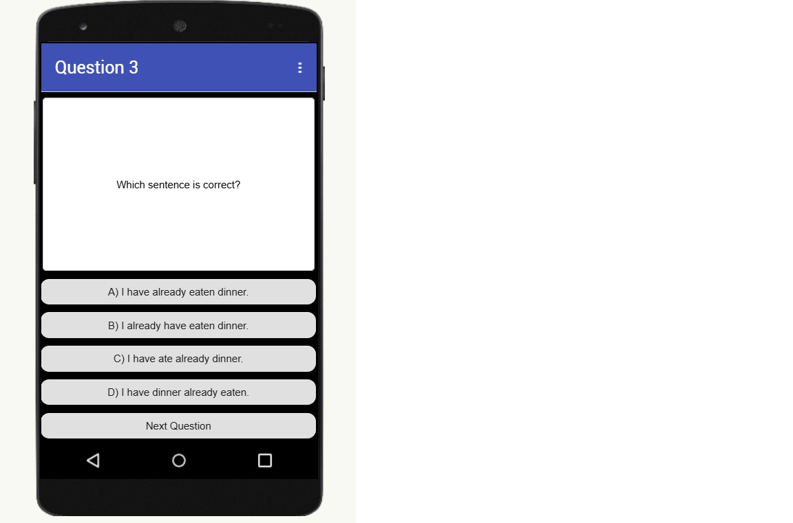
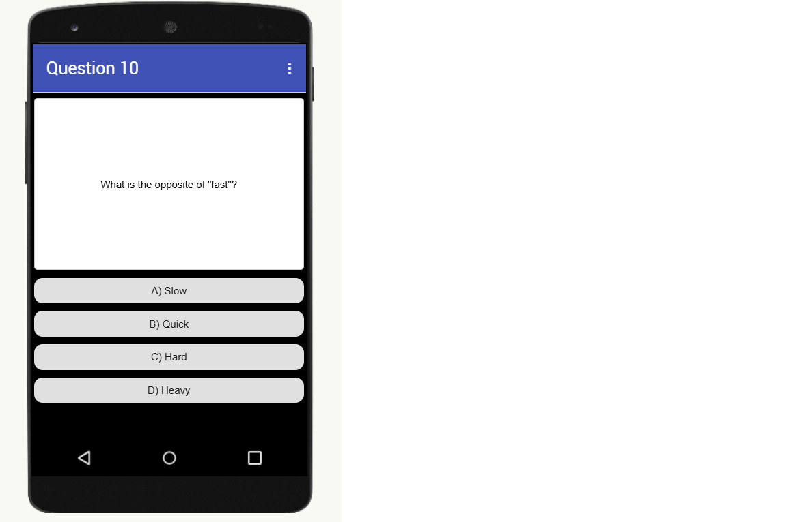

# Quiz-English
por: Gabriela, Heloísa e Míriam

### Tecnologias utilizadas
- Mit App Inventor;
- .apk;
- .aia

Tela inicial:

Exemplo do quiz (questão 3):

Página final e última pergunta do Quiz-English:

- Nome do professor que testou o quiz: Nivaldo (Professor de Inglês do SESI)
- Comentário do professor sobre o quiz, se gostou, se faria alguma sugestão de melhoria: Implementação de questões diferentes do que apenas achar uma resposta, tal como completar uma frase, por exemplo.
